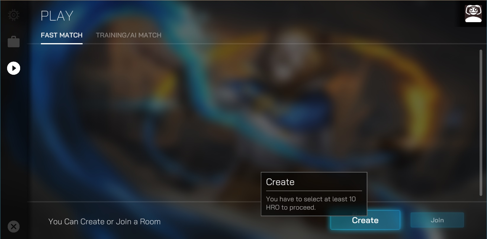
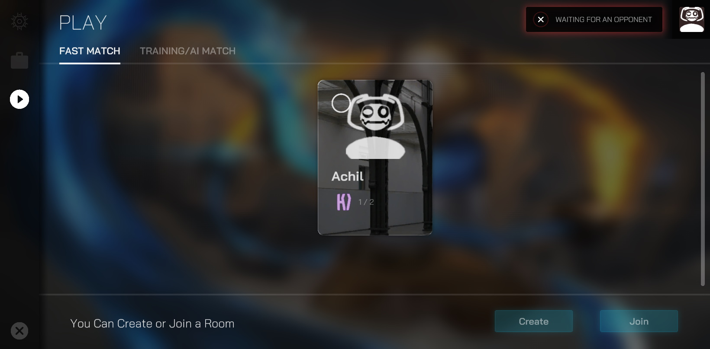
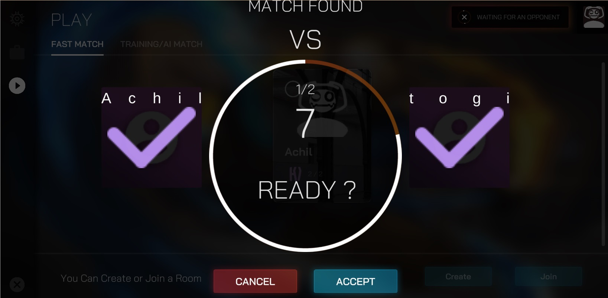
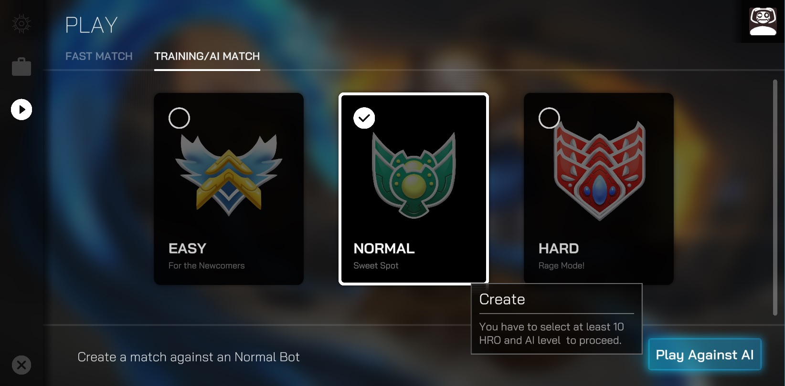

# Gameplay

#### [**Luminoria Tactics (LUTA) - How to Play**](https://luminoriatactics.com)

Welcome to _Luminoria Tactics_, a strategic turn-based collectible card game where you battle with unique heroes, build powerful decks, and earn rewards by showcasing your skills. Here’s a step-by-step guide to get you started and make the most of your gameplay experience:

***

**1. Getting Started**

* **Sign Up:**\
  Use social logins (Google, Facebook, or Apple) to sign up for [_Luminoria Tactics_.](https://luminoriatactics.com) When you sign up, a Web3 non-custodial wallet is automatically created for you.
* **Create Your Deck:**\
  Before you can enter the arena, you’ll need to create a deck of 8 hero cards. Each card has different stats, abilities, and slots for items. You can unlock new cards, upgrade them, and strategically build your deck to suit your preferred playstyle.

***

**2. Understanding the Arena**

* **Hero Cards:**\
  Every hero card has its own default power, slots (for items), rarity, and abilities. The higher the rarity, the more powerful the hero. You can attach items like spell cards, weapons, and cosmetics to heroes to enhance their abilities and appearance.
* **Arena Power Effects:**\
  Arena power effects change the dynamics of each match. These random effects can boost certain types of cards (e.g., Warrior Up, Mystic Up) or alter the power of all cards (e.g., Double Power, Half Power). Pay attention to these effects as they can dramatically impact your strategy.
* **Item Mechanics:**\
  Items can be attached to cards by dragging and dropping them into the item slots. These can increase a card's power, provide special abilities, or alter the course of a match. Items are collectible and can be traded on the marketplace.

***

**3. Gameplay Basics**

* **Starting the Game:**\
  Once you’ve created your deck, enter the battle arena. You and your opponent will take turns placing hero cards in the arena, where your heroes will battle each other.
* **Card Placement:**\
  Drag and drop a hero card onto the battlefield. The hero’s default power and rank will be shown.
* **Turn Mechanics:**\
  You and your opponent can take actions during your turns. Unlike other games, you don’t need to press a button to end your turn; actions can be done freely without interruption. This adds a layer of flexibility to your strategy.

***

**4. Combat Mechanics**

#### **Win Condition in** [**Luminoria Tactics**](https://luminoriatactics.com) **(LUTA)**

The goal of _Luminoria Tactics_ is to defeat your opponent by using your hero cards strategically. Here’s how you can win:

1. **Power Accumulation:**\
   Each hero card has a default power value. When you place a hero in the arena, it will battle your opponent's hero. The hero with the **higher power** wins the battle, and the winning hero absorbs the power of the defeated card, becoming stronger. If your hero's power becomes higher than your opponent’s, you will gain the upper hand in the match.
2. **Defeating Heroes:**\
   The match continues until one player’s **heroes are all defeated** or until one player’s heroes are significantly more powerful than the opponent’s. By strategically using items and abilities, you can increase the power of your heroes and make it harder for your opponent to win.
3. **Item Usage:**\
   Items (like weapons or spells) can be attached to your heroes, boosting their power and giving them special abilities. Use items wisely to gain an advantage in battles. You can attach them to your hero cards at any time during your turn as long as you have the energy (flux).
4. **Arena Power Effects:**\
   Keep an eye on the **random arena power effects** that can change the strength of certain cards or all cards on the field. For example, an effect like **Double Power** could make all cards stronger, while **Weakest Wins** could cause the weaker card to win. These effects can drastically change the flow of the game and influence your strategy.
5. **Winning the Match:**
   * If all of your opponent’s hero cards are defeated, you win the match.
   * If you accumulate more power than your opponent and control the battlefield, you win by **outlasting** them or by eliminating their heroes.

***

**5. Game Modes**

* **PvP (Player vs. Player):**\
  Face off against other players in exciting battles. Each player will control their own deck \

***

**6. Earning Rewards**

* **Loot Boxes:**\
  Completing matches and quests rewards you with loot boxes that contain valuable items such as spell cards, weapons, and cosmetics. These items can be used to upgrade your heroes and improve your deck.
* **HRM Tokens:**\
  Players earn HRM tokens by participating in PvP and PvE modes. These tokens can be used to upgrade items, buy new cards, and more.
* **Tournaments:**\
  Participate in tournaments to compete for large rewards. The top players in these events will receive generous prizes, including HRM tokens and exclusive items.

***

**7. Marketplace and Trading**

* **Buy and Sell Items:**\
  Marketplace functionality allows you to buy, sell, or trade wallet-ownable items such as spell cards, weapons, and cosmetics. This creates a dynamic in-game economy where items have real value.
* **HON Tokens:**\
  Holders of HON tokens play a crucial role in shaping the game’s future by voting on important decisions. These tokens can also be used to access exclusive in-game features.

***

**8. Progression System**

* **Hero Leveling:**\
  As your heroes win battles and earn experience points, they level up, increasing their power and unlocking new abilities.&#x20;
* **Reward Paths:**\
  Progress through the Elo and Seasonal Reward Paths to unlock exclusive rewards. These can include rare items, new heroes, and other valuable assets that improve your gameplay experience.

***

**9. Strategic Tips**

* **Deck Building:**\
  Carefully select heroes and items that complement each other. Pay attention to hero synergies and use your items wisely to maximize your deck’s potential.
* **Arena Awareness:**\
  Adapt your strategy to the arena’s changing power effects. Be prepared to adjust your tactics when effects like ‘Double Power’ or ‘Weakest Wins’ take place.
* **Item Management:**\
  Use items to counteract your opponent’s moves and protect your heroes. Fatecrusher spells can be game-changers, so save them for key moments.

***

<mark style="color:red;">(This gameplay version is outdated; it was designed for the POC version of the game. Please do not consider it as representative of the product we are currently working on.)</mark>

## **Create a game:**

* The beta test of the game is in the following link [https://app.heroesofnft.com/play](https://app.heroesofnft.com/play)

* Click on the "ENTER HERE" button
* The game will be loaded shortly. After that, click "INVENTORY" button on left side.

.jpg>)

* Players should have at least 10 cards to play the game.
* To create a game, a player should select 10 cards for his deck.
* &#x20;When the 10 cards have been selected, the HoN logo will appear at the top and start to animate.

.jpg>)

* After that click the Play button on left side.
* For the moment you can play against other players or AI Bots.

* To play against other players, one of the players should "Create" a game.

* The other player should “Join” the game.

* After two players click on ”ACCEPT”, the game screen will appear
* To Play against AI, click the "TRAINING/AI MATCH" button at the top.

* After that; select difficulty mode and click "Play Against AI" button.&#x20;
* READY TO GO!

## &#x20;Arena Screen

1. &#x20;At the top left side, you can see your stats. When you choose a card to attack or defend, you see your attack/defense power there. The orange bar is your attack power and the blue bar shows your defense power. You can follow the positions of your opponent at the right top side of the screen.
2. At the top right side; you can see your opponent's stats.&#x20;
3. You place your cards in three empty places and from left to right in the sequence you want to use them. The order matters and it is an important part of your strategy.
4. Your opponent will place his/her cards in three empty places and from left to right in the sequence they want to use their cards. The order matters and it is an important part of their strategy.
5. You can see your score under the player square. When you win a match, it will increase by 1; and whoever wins two matches will win the game.
6. You can see your opponent’s scor&#x65;**.**
7. The orange button at the center of the screen will help you transition between the two states of the game. State transitions are mostly done manually but later on, they will be automatized as much as possible.
8. The blue box shows the game instructions. Follow this message box to see what to do, at least for the beginning. Later on, you may not need the reminders.
9. The gray message box is nonfunctional at the moment, but later on, war logs or other related information will be posted there; and you will be able to follow while you play.

When you need to take action, Heroes of NFT logo will be rotating.

## **Heroes of NFT Cards**

There are two types of cards, attack cards and defense cards. The more offense or defense power they got the rarer they become. Rarity levels are common, uncommon, rare, epic, and legendary.

The attack power of the cards is at the left bottom, there is a sword icon near it.

The defense power of the cards is at the right bottom, there is a shield icon near it.

.png>).png>)

## **Game Mechanism**

The purpose of the game is to decrease the opponent’s health. But to make it easier to understand let’s imagine that you are a commander, and your opponent is a commander as well. You both have an army of Heroes. When there are no Heroes left defending the commander, it means that the commander is open to any attack. Only Heroes can defend the commander, to the limit of their defense power, and as long as they are put in defense mode.

* When the dice are rolled, the winner starts the game. But since the opponent will have no heroes to defend himself/herself, the attack will directly decrease the health power of the opponent's commander. The dice are rolled, and the winner has the chance to ambush his/her opponent.
* When a commander attacks the opponent, after this attack he becomes vulnerable to the opponent’s attack since the defense score is set to zero after every attack on the opponent.
* Players can select an attack or defense based on their strategy.&#x20;
* When Player No.1 selects defense mode for a hero, that hero cannot attack. If the hero is attacked but still alive for the next round; or if it is not been attacked by  Player No2 and in the next round Player No1 chooses to attack Player No2; the attack power of the hero which was previously in the defense mode and the attack power of the hero played in the current round are added together.&#x20;

.png>)

* When two cards are in the defense mode, defense powers are not added together, the card with weaker defense power is taken into account.
* Effect of the attacks are calculated as follow.

_Damage power = Attack power of the player – defense power of the opponent_&#x20;

_New Health power = health power – damage power_&#x20;

## **How to Play**

* In order to play the game with different tactics, players should have as many cards as possible.&#x20;
* Follow the instructions in the blue box.
* Click on the cards based on your strategy so that you can place the cards in your three places on the game screen

.png>)

* Resource management is important.&#x20;
* As it was told in the blue box, now the player should lock his deck (click on the orange button), then wait for his/her opponent's action.

.png>)

* After locking, the next step is rolling the dice to decide who starts the game first.

.png>)

* &#x20;If you rolled the highest number then you are the first to make the action.&#x20;

.png>)

* Click on the card to select a mode, attack, or defense.

.png>)

* After you decide to attack or defense, you should click on the orange button to approve. You can follow your position from your stats.

.png>)

* As can be seen, the player's Dmitry card with 83 attack power was put in attack mode and the opponent Rebecca with 74 defense power is in defense mode. 83-74 = 9, this amount will be deducted from the opponent player's health.&#x20;

.png>)

.png>)

* The Opponent player's health decreased from 170 to 161.
* These two heroes are out of the game now. There are skull icons over the cards.

.png>).png>)
