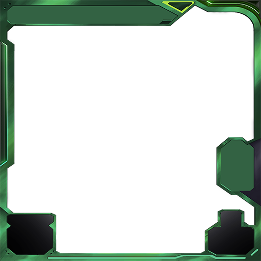
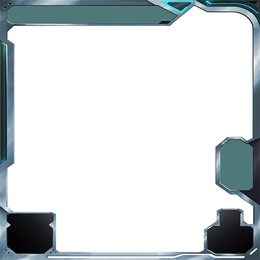
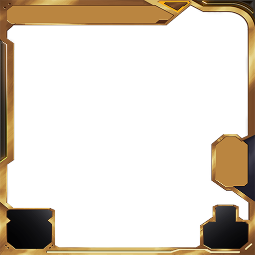
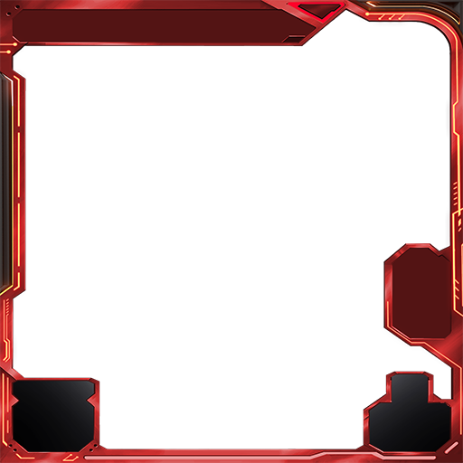
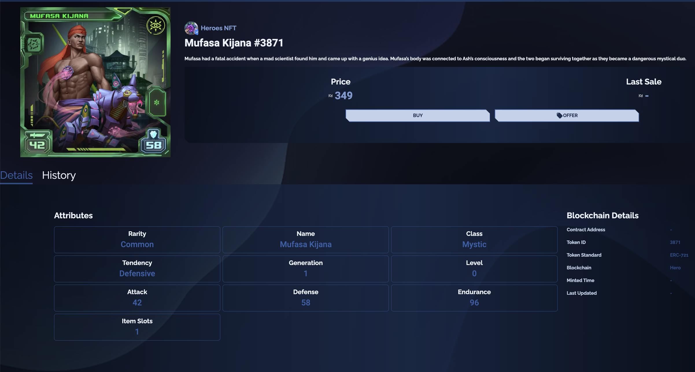

# How To Read Heroes of NFT Cards?

## Coloring of the cards: 

Heroes NFT - HRO (New NFT Contract): [0x40f118e9b9e3781DA838e021d5b9f3D070C93D00](https://snowtrace.io/address/0x40f118e9b9e3781DA838e021d5b9f3D070C93D00)&#x20;

Heroes of NFT Cards have some rules already coded on your unique cards. These simple rules are coded in colors and with icons. Heroes of NFT has five different rarity levels. These are Common Cards, Uncommon Cards, Rare Cards, Epic Cards and Legendary Cards. Each card has a different frame and color scheme, as seen below.

Common Card Frame

Uncommon Card Frame&#x20;

.png>)

Rare Card Frame

Epic Card Frame

Legendary Card Frame

These color schemes show the uniqueness of your card. Common Cards are the most issued cards whereas Epic Cards are less common. Our algorithm works in this way.

## Layout of the cards: 

Heroes of NFT has a unique game mechanism and our characters will bring you the enjoyment of playing collectible card games.&#x20;

<figure><figcaption>
One example from our NFT marketplace
</figcaption></figure>

## &#x20;

## &#x20;

## <mark style="color:orange;">The below description is for the first version of the cards</mark> 

## Coloring of the cards: 

**HeroesToken - HRO (Old NFT Contract):** [0xBD7bd0B4650D324e3eA6f734fAA3FC37d80b7D82](https://snowtrace.io/address/0xBD7bd0B4650D324e3eA6f734fAA3FC37d80b7D82)

Heroes of NFT Cards have some rules already coded on your unique cards. These simple rules are coded in colors and with icons. Heroes of NFT has five different rarity levels. These are Common Cards, Uncommon Cards, Rare Cards, Epic Cards and Legendary Cards. Each card has a different frame and color scheme, as seen below.

Common Card Frame

.png>)Uncommon Card Frame

.png>)Rare Card Frame

.png>)Epic Card Frame

.png>)Legendary Card Frame

These color schemes show the uniqueness of your card. Common Cards are the most issued cards whereas Epic Cards are less common. Our algorithm works in this way.

## Layout of the cards: 

.png>)

## Some examples: 

.png>)

The name of the character is Elis Celia, She is a warrior. Card has two HON stars and frame is green. It means it is an uncommon card. Her attack power is 63 and her defense power is 37.

.png>)

The name of the character is Dmitry Vlaslov, He is a gunslinger. Card has four HON stars and its frame is purple. It means it is an epic card. His attack power is 89 and his defense power is 11.

Heroes of NFT has a unique game mechanism and our characters will bring you the enjoyment of playing collectible card games. There is one more detail that was not mentioned in this document. Enjoy when you discover this detail!

Hint: Uniqueness
