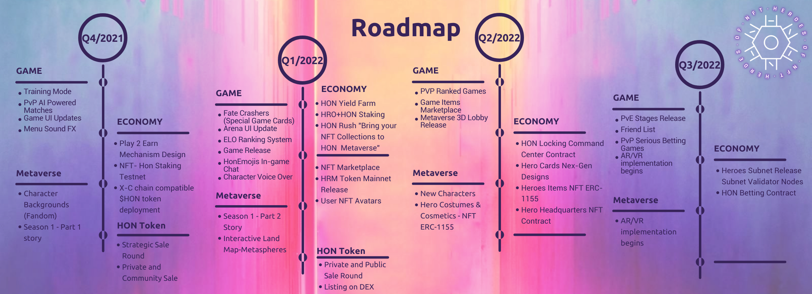

# Roadmap

## Q4/2021

### Game (Beta version of the game has already been released)&#x20;

* [x] Training Mode
* [x] PvP AI-Powered Matches
* [x] Game UI Updates
* [x] Menu Sound FX

### Metaverse

* [x] Character Backgrounds (Fandom)
* [x] Season 1 - Part 1 story

### Economy

* [x] Play 2 Earn Mechanism Design
* [x] NFT- Hon Staking Testnet
* [x] X-C chain compatible $HON token deployment

### HON Token

* [x] Strategic Sale Round
* [x] Private and Community Sale Round

## Q1/2022

### Game

* [ ] Fate Crashers (Special Game Cards)
* [ ] Arena UI Update
* [ ] ELO Ranking System
* [ ] Game Release
* [ ] HonEmojis In-game Chat
* [ ] Character Voice-Over

### Metaverse

* [ ] Season 1 - Part 2 Story
* [ ] Interactive Land Map-Metaspheres

### Economy

* [ ] HON Yield Farm
* [ ] HRO+HON Staking
* [ ] HON Rush "Bring your NFT Collections to HON Metaverse"
* [ ] NFT Marketplace
* [ ] HRM Token Mainnet Release
* [ ] User NFT Avatars

### HON Token

* [ ] Private and Public Sale Round
* [ ] Listing on DEX

## Q2/2022

### Game

* [ ] PVP Ranked Games
* [ ] Game Items Marketplace
* [ ] Metaverse 3D Lobby Release

### Metaverse

* [ ] New Characters
* [ ] Hero Costumes & Cosmetics - NFT ERC-1155

### Economy

* [ ] HON Locking Command Center Contract
* [ ] Hero Cards Nex-Gen Designs
* [ ] Heroes Items NFT ERC-1155
* [ ] Hero Headquarters NFT Contract

## Q3/2022

### Game

* [ ] PvE Stages Release
* [ ] Friend List
* [ ] PvP Serious Betting Games
* [ ] AR/VR implementation begins

### Metaverse

* [ ] AR/VR implementation begins

### Economy

* [ ] Heroes Subnet Release, Subnet Validator Nodes
* [ ] HON Betting Contract

